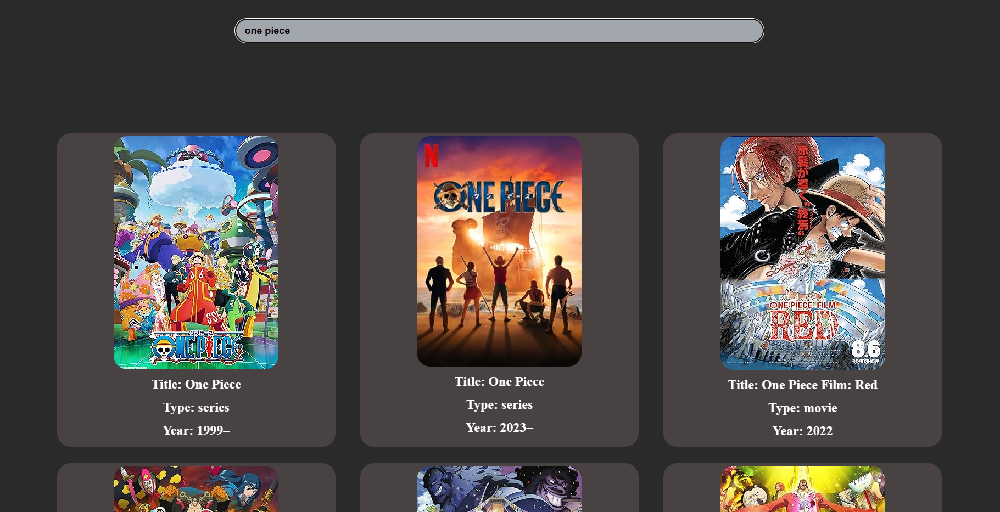

# Movie Explorer
Welcome to Movie Explorer   

# Table of Contents📄
- Tech Stack
- Features
- Installation
- License

# Tech Stack💫
- **Front End** - React.js
- **Back End** - Node.js , Express.js
- **API** - Open movie database(OMDb) API

  
# Features💫
- **Search Functionality** - Users can search for movies by title.
- **Movie Details** - When a user searches for movie, he gets basic information like title, year, and poster image.
- **API Integration** - The application utilizes an Open movie database(OMDb) API to retrieve movie information.
- **UserInterface** - Developed a user-friendly interface with search input fields and detailed movie information card.

# Installation🛠️
To run Movie Explorer locally, follow these steps:

- Clone the repository: `git clone https://github.com/doraemon7467/Movie-Explorer.git`
- Navigate to the project directory: `cd MovieExplorer`
- Navigate to the Backend directory: `cd Backend`
- Install server dependencies: `npm install`
- Navigate to the Frontend directory: `cd Frontend`
- Install Frontend dependencies: `npm install`
- Create a .env file in Backend :
   - `API_KEY = {YOUR_API_KEY}`
- Run the Frontend: `npm run dev`
- Run the Backend: `npm run dev`
  
# License📄

This project is licensed under the MIT License. Please feel free to use, modify, and distribute this code according to the terms of the license.

---
Feel free to star the repository if you find it useful, and don't forget to share it with others who might benefit from this tool. 
Happy Movie Searching! 
